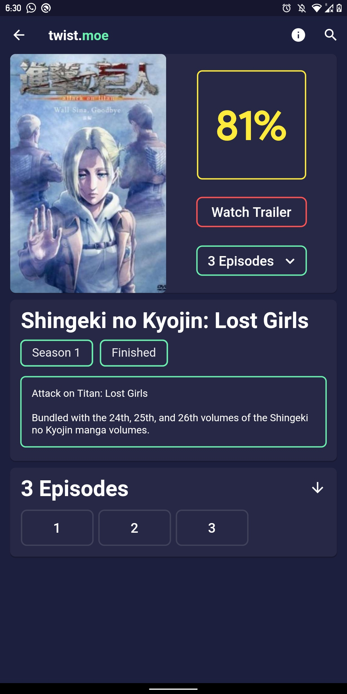
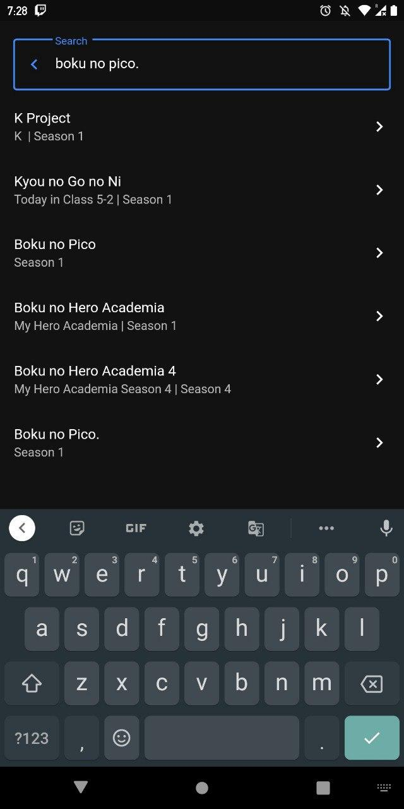
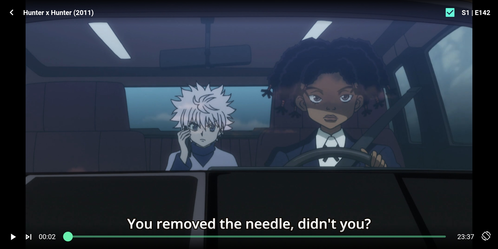
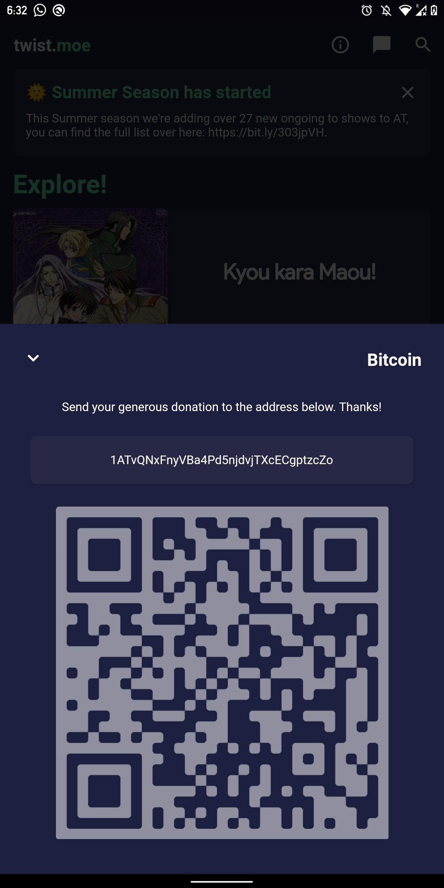
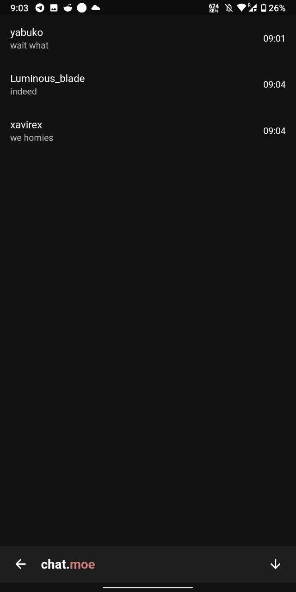
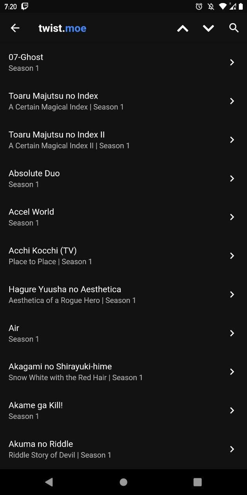

# AnimeTwistFlut

## An unofficial twist.moe client written in flutter

                     

## Building
    flutter pub get
    flutter run --dart-define=TOKEN=<access-token> --dart-define=KEY='<secret_key>' --release 
You can get the respective token and key by asking the AnimeTwist team.